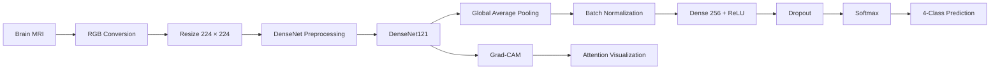

<div align="center">


# 🧠 Brain Tumor Detection & Classification

### DenseNet121 • Brain MRI Classification • Grad-CAM Explainability


<br>

[](https://brain-tumor-detection-ai-158.streamlit.app/)
[](https://github.com/archisharma158-cmd/Brain-Tumor-Detection-DenseNet)

<br>


</div>

---

## 🌐 Live Application

The complete project is deployed and can be tested directly online:

### 👉 [Launch Brain Tumor Detection AI](https://brain-tumor-detection-ai-158.streamlit.app/)

Upload a supported brain MRI image to:

- classify the MRI into one of four categories,
- view model confidence and class probabilities,
- inspect the model's attention using Grad-CAM,
- explore model architecture and performance,
- and download a generated prediction report.

> [!IMPORTANT]
> **Medical Disclaimer:**  
> This system is developed for educational and research purposes only and is not intended to replace professional medical diagnosis.

---

## 📌 Table of Contents

- [Project Overview](#-project-overview)
- [Problem Statement](#-problem-statement)
- [Live Application](#-live-application)
- [Model Performance](#-model-performance)
- [Key Features](#-key-features)
- [How It Works](#-how-it-works)
- [Architecture](#-architecture)
- [Technology Stack](#-technology-stack)
- [Dataset](#-dataset)
- [Dataset Structure](#-dataset-structure)
- [Preprocessing](#-preprocessing)
- [Training Strategy](#-training-strategy)
- [Grad-CAM Explainability](#-grad-cam-explainability)
- [Streamlit Application](#-streamlit-application)
- [Installation](#-installation)
- [Running the Project](#-running-the-project)
- [Jupyter Notebook Workflow](#-jupyter-notebook-workflow)
- [Project Structure](#-project-structure)
- [Testing](#-testing)
- [Deployment](#-deployment)
- [Limitations](#-limitations)
- [Future Improvements](#-future-improvements)
- [Author](#-author)
- [License](#-license)

---

# 🔬 Project Overview

This project presents an end-to-end deep learning system for **brain tumor classification from MRI images** using **DenseNet121 transfer learning**.

The system classifies MRI scans into four categories:

| Class | Description |
|---|---|
| 🧠 **Glioma** | Tumor originating from glial cells |
| 🧠 **Meningioma** | Tumor arising from the meninges |
| ✅ **No Tumor** | MRI without a tumor from the dataset class |
| 🧠 **Pituitary Tumor** | Tumor affecting the pituitary gland |

The project covers the complete machine-learning lifecycle:

```text
MRI Dataset
     ↓
Dataset Validation
     ↓
Exploratory Data Analysis
     ↓
Image Preprocessing
     ↓
Data Augmentation
     ↓
DenseNet121 Transfer Learning
     ↓
Selective Fine-Tuning
     ↓
Held-Out Test Evaluation
     ↓
MRI Classification
     ↓
Grad-CAM Explainability
     ↓
Interactive Streamlit Application
     ↓
Cloud Deployment
```

The objective is not only to produce a prediction, but also to make the model pipeline **reproducible, explainable, testable, and accessible through a real web interface**.

---

# 🎯 Problem Statement

Manual interpretation of medical imaging requires trained specialists and careful clinical evaluation.

This academic project explores how deep learning can be used to analyze brain MRI images and distinguish between common MRI categories using a pretrained convolutional neural network.

The project focuses on:

- multi-class MRI classification,
- transfer learning,
- model fine-tuning,
- held-out test evaluation,
- prediction confidence visualization,
- and explainable AI using Grad-CAM.

The system is **not designed for clinical diagnosis** and should be treated as an educational AI implementation.

---

# 📊 Model Performance

The final DenseNet121 model was evaluated on a **held-out test set of 400 MRI images**.

| Metric | Result |
|---|---:|
| **Test Accuracy** | **91.50%** |
| **Macro Precision** | **91.93%** |
| **Macro Recall** | **91.50%** |
| **Macro F1-Score** | **91.25%** |

### One-vs-Rest ROC-AUC

| MRI Class | AUC |
|---|---:|
| Glioma | **0.9907** |
| Meningioma | **0.9716** |
| No Tumor | **0.9996** |
| Pituitary Tumor | **0.9947** |

> These values come from the held-out test evaluation and should be interpreted as performance on this dataset, not as evidence of clinical diagnostic performance.

---

# ✨ Key Features

### 🧠 DenseNet121 Transfer Learning
Uses an ImageNet-pretrained DenseNet121 backbone for efficient feature extraction from MRI images.

### 🔄 Two-Stage Training
The network is trained using:

1. **Feature Extraction**
   - DenseNet121 backbone frozen
   - custom classification head trained

2. **Selective Fine-Tuning**
   - upper DenseNet layers unfrozen
   - lower learning rate used for refinement

### 🔍 Grad-CAM Explainability
Generates real gradient-based activation maps showing which regions influenced a model prediction.

### 📊 Complete Evaluation
Includes:

- accuracy,
- macro precision,
- macro recall,
- macro F1-score,
- classification report,
- confusion matrix,
- class-wise metrics,
- ROC curves,
- AUC scores.

### 🖼️ MRI Prediction
Users can upload a brain MRI through the Streamlit interface and receive:

- predicted class,
- confidence score,
- probability distribution,
- Grad-CAM visualization.

### 📄 Prediction Reports
The application can generate structured information for individual MRI analyses.

### 🧪 Dataset Validation
The project automatically checks:

- dataset availability,
- expected directory structure,
- class folders,
- image extensions,
- folder aliases.

### 🌐 Deployed Web Application
The complete inference system is available through Streamlit Community Cloud.

---

# ⚙️ How It Works



---

# 🧠 Architecture

The model uses **DenseNet121** as its feature extractor.

```text
Input MRI
224 × 224 × 3
        │
        ▼
┌─────────────────────────┐
│ DenseNet121             │
│ ImageNet Pretrained     │
│ include_top = False     │
└─────────────────────────┘
        │
        ▼
GlobalAveragePooling2D
        │
        ▼
BatchNormalization
        │
        ▼
Dense(256, ReLU)
L2 Regularization
        │
        ▼
Dropout(0.35)
        │
        ▼
Dense(4, Softmax)
        │
        ▼
MRI Classification
```

### Why DenseNet121?

DenseNet creates direct connections between layers, allowing later layers to reuse earlier feature representations.

This helps with:

- feature reuse,
- gradient flow,
- parameter efficiency,
- transfer learning,
- medical-image feature extraction.

---

# 🛠️ Technology Stack

| Area | Technology |
|---|---|
| Programming | Python |
| Deep Learning | TensorFlow 2.20 / Keras |
| Architecture | DenseNet121 |
| Image Processing | OpenCV, Pillow |
| Numerical Computing | NumPy |
| Data Analysis | Pandas |
| Machine Learning Metrics | Scikit-learn |
| Visualization | Matplotlib, Plotly |
| Explainability | Grad-CAM |
| Web Interface | Streamlit |
| Testing | Pytest |
| Notebook | Jupyter |
| Deployment | Streamlit Community Cloud |
| Version Control | Git + GitHub |

---

# 🗂️ Dataset

The project uses the **Brain Tumor MRI Dataset by Masoud Nickparvar** available on Kaggle.

### Dataset

**Brain Tumor MRI Dataset**

https://www.kaggle.com/datasets/masoudnickparvar/brain-tumor-mri-dataset

### Classes

```text
glioma
meningioma
notumor
pituitary
```

The dataset itself is not committed to this repository because of its size.

---

# 📁 Dataset Structure

Recommended structure:

```text
dataset/
├── Training/
│   ├── glioma/
│   ├── meningioma/
│   ├── notumor/
│   └── pituitary/
│
└── Testing/
    ├── glioma/
    ├── meningioma/
    ├── notumor/
    └── pituitary/
```

The project also supports the nested Kaggle structure:

```text
dataset/
└── Brain Tumor MRI Dataset/
    ├── Training/
    └── Testing/
```

Custom locations can be supplied using:

```powershell
$env:BRAIN_TUMOR_DATASET_DIR = "D:\Datasets\Brain Tumor MRI Dataset"
```

The dataset resolver also handles class-name variations such as:

```text
Glioma
No Tumor
no_tumor
pituitary_tumor
```

while maintaining the canonical internal order:

```python
("glioma", "meningioma", "notumor", "pituitary")
```

---

# 🖼️ Preprocessing

Every image passes through a consistent preprocessing pipeline.

```text
Input MRI
   ↓
Load image
   ↓
Convert to RGB
   ↓
Resize to 224 × 224
   ↓
Convert to float tensor
   ↓
DenseNet preprocess_input()
   ↓
Model input
```

Supported formats:

```text
.jpg
.jpeg
.png
```

Training data additionally uses conservative image augmentation to improve generalization.

---

# 🏋️ Training Strategy

Training is divided into two stages.

## Stage 1 — Feature Extraction

The pretrained DenseNet121 backbone remains frozen.

```text
Initial Learning Rate: 1e-3
Initial Epochs: 12
```

Only the custom classification head is trained.

---

## Stage 2 — Fine-Tuning

The upper DenseNet121 layers are selectively unfrozen.

```text
Fine-Tuning Layers: 40
Fine-Tuning Learning Rate: 1e-5
Fine-Tuning Epochs: 8
```

Batch Normalization layers remain protected during fine-tuning to avoid destabilizing pretrained statistics.

Training uses callbacks including:

- `EarlyStopping`
- `ModelCheckpoint`
- `ReduceLROnPlateau`

The final selected model is stored as:

```text
models/best_densenet121.keras
```

---

# 🔥 Grad-CAM Explainability

The application includes **Gradient-weighted Class Activation Mapping (Grad-CAM)**.

Grad-CAM computes gradients of the predicted class score with respect to convolutional feature maps.

\[
\alpha_k^c =
\frac{1}{Z}
\sum_i
\sum_j
\frac{\partial y^c}
{\partial A_{i,j}^{k}}
\]

The class activation map is then calculated as:

\[
L_{\text{Grad-CAM}}^c =
ReLU
\left(
\sum_k \alpha_k^c A^k
\right)
\]

The resulting map is resized and overlaid on the original MRI.

### Important

Grad-CAM shows regions that **influenced the neural network's prediction**.

It does **not** medically localize or segment a tumor and should not be interpreted as a clinical diagnostic map.

---

# 🖥️ Streamlit Application

The project includes a custom clinical-inspired Streamlit interface.

### Application Pages

#### 🏠 Home
Provides:

- project overview,
- workflow,
- model status,
- main capabilities.

#### 🔬 MRI Analysis
Allows users to:

- upload MRI images,
- run model inference,
- inspect predicted class,
- inspect probability distribution,
- generate Grad-CAM,
- download prediction information.

#### 🧠 Model Information
Explains:

- DenseNet121,
- transfer learning,
- preprocessing,
- architecture,
- training methodology.

#### 📊 Performance
Displays available model evaluation information and visualizations.

#### ℹ️ About Project
Provides:

- project context,
- objectives,
- limitations,
- educational disclaimer.

---

# 🚀 Installation

## 1. Clone the repository

```bash
git clone https://github.com/archisharma158-cmd/Brain-Tumor-Detection-DenseNet.git
cd Brain-Tumor-Detection-DenseNet
```

---

## 2. Create a virtual environment

### Windows

```powershell
python -m venv .venv
.venv\Scripts\activate
```

### Linux / macOS

```bash
python3 -m venv .venv
source .venv/bin/activate
```

---

## 3. Upgrade pip

```bash
python -m pip install --upgrade pip
```

---

## 4. Install dependencies

```bash
pip install -r requirements.txt
```

---

# ▶️ Running the Project

## Launch the Streamlit application

```bash
python -m streamlit run app/app.py
```

or:

```bash
python run_app.py
```

Then open the local Streamlit URL shown in the terminal.

---

## Train the model

```bash
python -m src.train
```

Optional:

```bash
python -m src.train \
    --dataset-dir "dataset" \
    --initial-epochs 12 \
    --fine-tune-epochs 8 \
    --batch-size 16
```

---

## Evaluate the model

```bash
python -m src.evaluate
```

Evaluation can generate:

```text
results/evaluation_metrics.json
results/classification_report.json
results/plots/confusion_matrix.png
results/plots/class_wise_metrics.png
results/plots/roc_curves.png
```

---

## Predict from the command line

```bash
python -m src.predict path/to/mri.jpg
```

---

# 📓 Jupyter Notebook Workflow

The project contains:

```text
notebooks/Brain_Tumor_DenseNet.ipynb
```

The notebook follows a structured **29-step academic workflow** covering:

1. Problem statement
2. Medical disclaimer
3. Environment diagnostics
4. Project-root discovery
5. Dataset discovery
6. Dataset validation
7. Exploratory data analysis
8. Class distribution
9. Sample MRI visualization
10. Image preprocessing
11. Data augmentation
12. TensorFlow dataset creation
13. DenseNet121 construction
14. Architecture explanation
15. Stage-1 setup
16. Feature-extraction training
17. Stage-1 curves
18. Fine-tuning setup
19. Fine-tuning
20. Final model selection
21. Held-out test evaluation
22. Accuracy / precision / recall / F1
23. Classification report
24. Confusion matrix
25. ROC-AUC analysis
26. Single-image prediction
27. Probability visualization
28. Grad-CAM
29. Conclusions and viva preparation

Training can be controlled through notebook flags such as:

```python
RUN_TRAINING = False
QUICK_TEST = False
```

---

# 📂 Project Structure

```text
Brain-Tumor-Detection-DenseNet/
│
├── .streamlit/
│   └── config.toml
│
├── app/
│   ├── assets/
│   │   └── logo.png
│   ├── __init__.py
│   ├── app.py
│   ├── predictor.py
│   ├── gradcam.py
│   └── utils.py
│
├── src/
│   ├── __init__.py
│   ├── config.py
│   ├── dataset_utils.py
│   ├── data_loader.py
│   ├── preprocessing.py
│   ├── eda.py
│   ├── model.py
│   ├── train.py
│   ├── evaluate.py
│   └── predict.py
│
├── notebooks/
│   └── Brain_Tumor_DenseNet.ipynb
│
├── dataset/
│   └── README.md
│
├── models/
│   └── best_densenet121.keras
│
├── results/
│   └── plots/
│
├── sample_images/
│
├── tests/
│   ├── test_dataset_utils.py
│   ├── test_prediction.py
│   ├── test_preprocessing.py
│   └── test_project_structure.py
│
├── .gitignore
├── LICENSE
├── pytest.ini
├── README.md
├── requirements.txt
└── run_app.py
```

---

# 🧪 Testing

Run the project test suite using:

```bash
pytest -v
```

Tests cover important functionality including:

- project structure,
- dataset discovery,
- class alias normalization,
- preprocessing contracts,
- prediction behavior.

---

# ☁️ Deployment

The application is deployed using **Streamlit Community Cloud**.

### Production Configuration

```text
Python: 3.12
TensorFlow: 2.20.0
Entrypoint: app/app.py
Model: models/best_densenet121.keras
```

### Live Deployment

🔗 **https://brain-tumor-detection-ai-158.streamlit.app/**

Updates pushed to the connected GitHub branch can be reflected in the deployed application through Streamlit's deployment workflow.

---

# ⚠️ Limitations

This project has several important limitations:

- It is trained on a specific public MRI dataset.
- Dataset performance does not automatically represent real hospital performance.
- MRI acquisition conditions may differ across scanners and institutions.
- Softmax confidence is not equivalent to medical certainty.
- Grad-CAM represents model attention, not tumor segmentation.
- The model has not undergone clinical validation.
- The application must not be used for patient diagnosis or treatment decisions.

---

# 🔮 Future Improvements

Possible future extensions include:

- external-dataset validation,
- stronger duplicate/leakage analysis,
- probability calibration,
- tumor segmentation,
- uncertainty estimation,
- model comparison with EfficientNet / ConvNeXt / Vision Transformers,
- richer explainability techniques,
- DICOM support,
- experiment tracking,
- Docker deployment,
- API-based inference,
- automated model monitoring.

---

# 🎓 Academic Value

This repository demonstrates practical understanding of:

```text
Deep Learning
Computer Vision
Transfer Learning
CNN Architectures
Medical Image Classification
TensorFlow / Keras
Data Pipelines
Model Evaluation
Explainable AI
Grad-CAM
Streamlit
Software Engineering
Git / GitHub
Cloud Deployment
```

It is designed not simply as a notebook experiment, but as a complete AI project with:

**data → training → evaluation → explainability → interface → deployment**

---

# 👩‍💻 Author

<div align="center">

### Archi Sharma

**B.Tech Computer Science & Engineering — Artificial Intelligence & Machine Learning**

[](https://github.com/archisharma158-cmd)

<br>

*Building practical AI systems while learning the concepts behind them.*

</div>

---

# 🤝 Contributing

Suggestions, improvements, and constructive feedback are welcome.

To contribute:

```bash
git checkout -b feature/your-feature
git commit -m "Add your feature"
git push origin feature/your-feature
```

Then open a pull request describing the proposed changes.

---

# ⭐ Support

If you found this project useful or interesting, consider giving the repository a **⭐ star**.

It helps others discover the project and supports continued development.

---

# 📜 License

This project is distributed under the **MIT License**.

See [`LICENSE`](LICENSE) for details.

---

<div align="center">

### 🧠 AI for learning • 🔬 Explainability for understanding • 🚀 Deployment for accessibility

<br>

**Developed by Archi Sharma**

</div>
